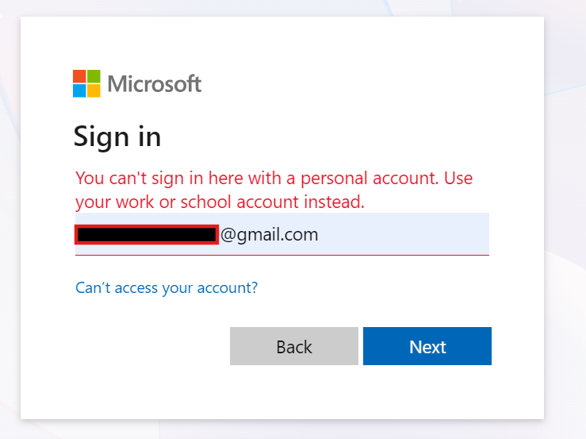

# Frequently Asked Questions

Before you get started, ensure you follow the steps in the `README.md` file. This will help you get up and running and connected to your Azure DevOps organization.

## Does the MCP Server support both Azure DevOps Services and on-premises deployments?

In this fork, both Azure DevOps Services and Azure DevOps Server (on-premises) are supported, with some limitations.

For on-prem details, see [FORK-ONPREM-PAT.md](./FORK-ONPREM-PAT.md).

## Can I connect to more than one organization at a time?

No, you can connect to only one organization at a time. However, you can switch organizations as needed.

## Can I set a default project instead of fetching the list every time?

Currently, you need to fetch the list of projects so the LLM has context about the project name or ID. We plan to improve this experience in the future by leveraging prompts. In the meantime, you can set a default project name in your `copilot-instructions.md` file.

## Are PAT's supported?

Yes. This fork supports PAT authentication with:

- `ADO_PAT` (recommended, raw PAT value)
- `PERSONAL_ACCESS_TOKEN` (raw PAT value)
- legacy compatibility for base64 `email:pat` in `PERSONAL_ACCESS_TOKEN`

For setup examples and caveats, see [FORK-ONPREM-PAT.md](./FORK-ONPREM-PAT.md).

## Is there a remote supported version of the MCP Server?

At this time, only the local version of the MCP Server is supported.

## Are personal accounts supported?

Unfortunately, personal accounts are not supported. To maintain a higher level of authentication and security, your account must be backed by Entra ID. If you receive an error message like this, it means you are using a personal account.

## When will a remote Azure DevOps MCP Server be availble?

We receive this question frequently. The good news is that work is currently underway. Development began in early January 2026. Once we can provide a reliable timeline, we will publish it on the public [Azure DevOps roadmap](https://learn.microsoft.com/en-us/azure/devops/release-notes/features-timeline).
